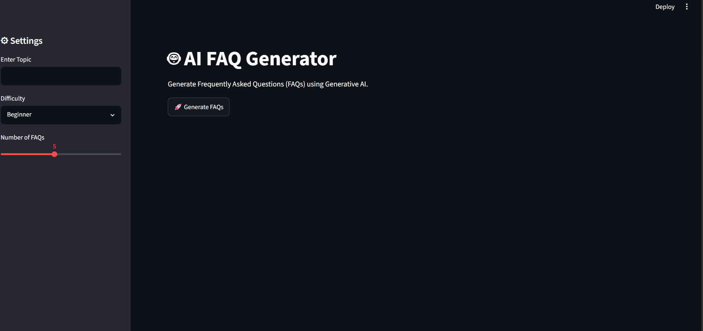
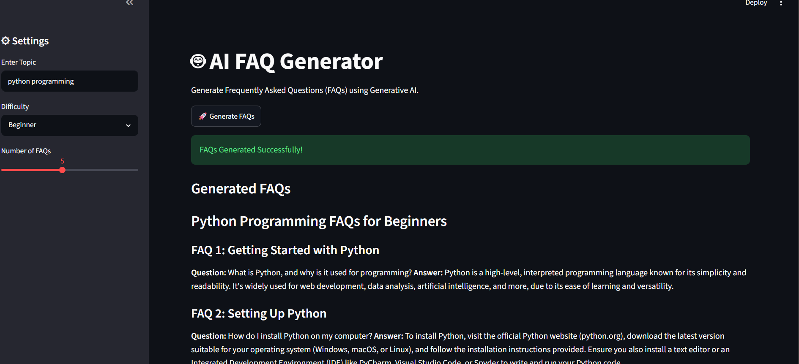

## 🤖 AI FAQ Generator

## 📌 Project Overview

AI FAQ Generator is a Generative AI web application built using Python, Streamlit, and the Groq API. It automatically generates Frequently Asked Questions (FAQs) and answers based on any topic entered by the user.

---

## 🚀 Features

- Generate FAQs on any topic
- Select difficulty level
- Choose the number of FAQs
- AI-generated answers using Groq
- Download FAQs as a text file
- User-friendly Streamlit interface

---

## 🛠️ Technologies Used

- Python
- Streamlit
- Groq API
- python-dotenv
- Prompt Engineering

---

## 📂 Project Structure

```
AI_FAQ_Generator/
│
├── app.py
├── .env
├── requirements.txt
├── README.md
└── venv/
```

---

## ⚙️ Installation

### Clone the project

```bash
git clone <repository-url>
```

### Open the project

```bash
cd AI_FAQ_Generator
```

### Create Virtual Environment

```bash
python -m venv venv
```

### Activate Virtual Environment

Windows

```bash
venv\Scripts\activate
```

### Install Required Packages

```bash
pip install -r requirements.txt
```

---

## 🔑 Configure API Key

Create a `.env` file.

Add your Groq API Key.

```
GROQ_API_KEY=your_api_key_here
```

---

## ▶️ Run the Project

```bash
streamlit run app.py
```

---

## 📷 Output

The application allows users to:

- Enter any topic
- Select difficulty level
- Choose the number of FAQs
- Generate AI-powered FAQs
- Download the generated FAQs

---
## 📸 Project Screenshots

### Home Page


### Input


### Output


## 👨‍💻 Author

SK.Anees
